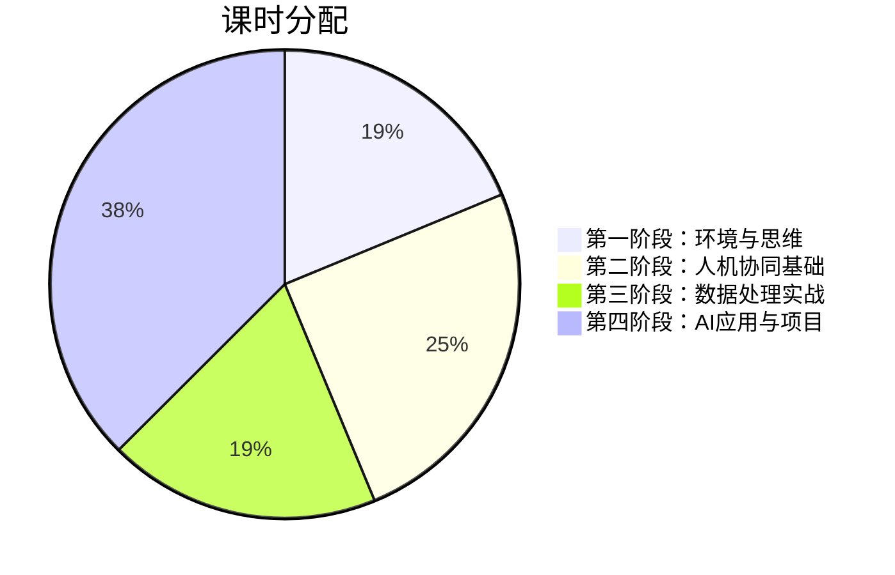
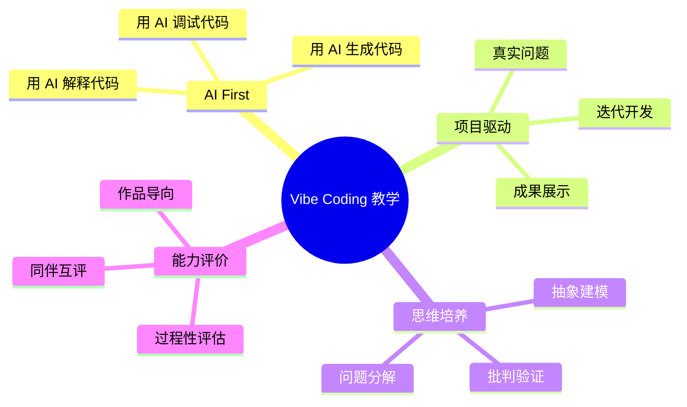

# Python程序设计课程大纲（32课时）

## 核心理念：Vibe Coding First

基于 Andrej Karpathy 的 **Vibe Coding** 理念，本课程彻底颠覆传统编程教学，培养学生在 AI 时代的核心竞争力：**与 AI 协同编程的能力**，而非死记硬背语法。

> [!IMPORTANT]
> **传统模式已过时**：在 Cursor、Copilot 等 AI 编辑器普及的今天，逐行手写代码、死记语法、期末机考的教学模式已完全失去意义。学生需要学会的是—— **如何精准地描述问题、引导 AI 生成代码、验证和迭代结果**。

---

## 课程目标

| 传统能力（弱化） | AI 时代核心能力（强化） |
|-----------------|----------------------|
| 背诵语法规则 | 精准描述需求（Prompt Engineering） |
| 手写算法代码 | 引导 AI 生成并验证代码 |
| 调试语法错误 | 理解代码逻辑与架构设计 |
| 期末考试 | 项目驱动 + 过程性评价 |

---

## 课时分配（共32课时）



---

## 第一阶段：环境搭建与计算思维（6课时）

### 第1周：开学导论与工具配置（2课时）

**学习目标**：理解 AI 时代编程的范式转变，配置开发环境

| 内容 | 形式 |
|-----|------|
| AI 编程革命：从"写代码"到"引导代码" | 讲授 + 演示 |
| Andrej Karpathy 的 Vibe Coding 哲学 | 视频 + 讨论 |
| Cursor AI 安装与配置 | 实操 |
| 第一次对话：用自然语言生成 Hello World | 实践 |

**课后任务**：用 Cursor 生成一个简单的个人介绍程序

---

### 第2周：计算思维与问题分解（2课时）

**学习目标**：掌握将现实问题转化为可执行步骤的能力

| 内容 | 形式 |
|-----|------|
| 什么是计算思维？ | 讲授 |
| 问题分解：从需求到伪代码 | 案例分析 |
| Prompt Engineering 基础：如何向 AI 清晰描述问题 | 实践 |
| 实战：用自然语言让 AI 实现"计算器"功能 | 课堂练习 |

**课后任务**：选择一个生活场景，写出问题描述 Prompt，让 AI 生成解决方案

---

### 第3周：代码理解与调试思维（2课时）

**学习目标**：能够阅读、理解和调试 AI 生成的代码

| 内容 | 形式 |
|-----|------|
| Python 核心语法速览（变量、条件、循环） | AI 辅助讲解 |
| 如何阅读代码：从入口点到执行流程 | 演示 |
| 当 AI 生成错误代码时怎么办？ | 案例分析 |
| 调试技巧：用 AI 解释代码、定位问题 | 实践 |

**课后任务**：给一段有 Bug 的代码，用 AI 定位问题并修复

---

## 第二阶段：人机协同编程基础（8课时）

### 第4周：函数与模块化设计（2课时）

**学习目标**：理解模块化思想，能够用 AI 生成可复用的函数

| 内容 | 形式 |
|-----|------|
| 为什么需要函数？从复制粘贴到抽象 | 讲授 |
| 用自然语言描述功能，让 AI 生成函数 | 实践 |
| 函数的输入输出设计原则 | 案例分析 |
| Cursor Tab Complete 与代码补全 | 实操演示 |

**课后任务**：用 AI 生成一个包含多个函数的"成绩管理系统"

---

### 第5周：数据结构直觉（2课时）

**学习目标**：建立对常用数据结构的直觉，知道何时使用何种结构

| 内容 | 形式 |
|-----|------|
| 列表、字典、集合：什么时候用什么？ | 场景驱动讲解 |
| 让 AI 帮你选择合适的数据结构 | 实践 |
| JSON 数据处理实战 | 课堂练习 |
| 实战：处理一份真实的学生信息数据 | 项目驱动 |

**课后任务**：用 AI 生成一个"通讯录"程序，支持增删改查

---

### 第6周：文件操作与外部数据（2课时）

**学习目标**：掌握与外部世界交互的数据读写能力

| 内容 | 形式 |
|-----|------|
| 读写文本文件、CSV、JSON | AI 辅助讲解 |
| Prompt 技巧：如何让 AI 处理文件路径问题 | 实践 |
| 实战：批量处理文件（改名、整理） | 课堂练习 |
| 自动化脚本思维 | 案例分析 |

**课后任务**：用 AI 生成一个"文件整理助手"

---

### 第7周：错误处理与健壮性（2课时）

**学习目标**：理解异常处理，让程序更加健壮

| 内容 | 形式 |
|-----|------|
| 程序为什么会崩溃？常见错误类型 | 案例分析 |
| 异常处理：try-except 的直觉 | AI 辅助讲解 |
| 让 AI 帮你预判和处理潜在错误 | 实践 |
| 防御式编程思维 | 讨论 |

**课后任务**：改进之前的项目，增加错误处理

---

## 第三阶段：数据处理与可视化实战（6课时）

### 第8周：数据科学工具链（2课时）

**学习目标**：认识 Python 数据科学生态，学会用 AI 快速上手

| 内容 | 形式 |
|-----|------|
| NumPy、Pandas、Matplotlib 生态速览 | 讲授 |
| 不需要背 API：用 AI 查询和生成代码 | 演示 |
| Jupyter Notebook 与交互式编程 | 实操 |
| 实战：加载并探索一份真实数据集 | 课堂练习 |

**课后任务**：用 AI 分析一份公开数据集（如天气、股票）

---

### 第9周：数据清洗与预处理（2课时）

**学习目标**：掌握数据清洗的核心概念和方法

| 内容 | 形式 |
|-----|------|
| 真实数据的"脏"：缺失值、异常值、格式问题 | 案例分析 |
| Pandas 数据清洗：用 AI 生成清洗代码 | 实践 |
| 数据转换与特征工程基础 | 讲解 |
| 实战：清洗并准备一份分析用数据 | 项目驱动 |

**课后任务**：选择一份"脏"数据，用 AI 完成清洗

---

### 第10周：数据可视化（2课时）

**学习目标**：用可视化讲述数据背后的故事

| 内容 | 形式 |
|-----|------|
| 可视化的目的：从数据到洞见 | 讲授 |
| Matplotlib、Seaborn 快速上手（AI 辅助） | 实践 |
| 图表选择：什么数据用什么图？ | 案例分析 |
| 实战：为数据分析结果创建可视化报告 | 课堂练习 |

**课后任务**：用 AI 生成一份数据可视化报告

---

## 第四阶段：AI 应用与综合项目（12课时）

### 第11周：API 基础与 LLM 入门（2课时）

**学习目标**：掌握 API 调用，初步体验 LLM API

| 内容 | 形式 |
|-----|------|
| 什么是 API？HTTP 请求基础 | 讲授 |
| requests 库：用 AI 生成 API 调用代码 | 实践 |
| LLM API 入门：调用 DeepSeek API | 演示 |
| API Key 安全管理与 .env 文件 | 实操 |

**课后任务**：尝试调用 DeepSeek API，完成一次简单对话

---

### 第12周：LLM 应用开发（2课时）

**学习目标**：深入理解 LLM API，构建 AI 应用

| 内容 | 形式 |
|-----|------|
| LLM API 进阶：多轮对话、System Prompt | 讲授 |
| Prompt Engineering：Few-shot、思维链 | 实践 |
| 流式输出与用户体验 | 演示 |
| 实战：构建一个有特定人设的聊天机器人 | 课堂练习 |

**课后任务**：用 AI 构建一个有特定功能的聊天机器人

---

### 第13周：Web 应用基础（2课时）

**学习目标**：理解 Web 应用架构，用 AI 快速构建原型

| 内容 | 形式 |
|-----|------|
| Web 应用基础架构：前端 + 后端 | 讲授 |
| Streamlit/Gradio：用 AI 快速构建 Web 界面 | 演示 |
| 实战：为之前的项目添加 Web 界面 | 课堂练习 |
| 部署基础：让别人能访问你的应用 | 讲解 |

**课后任务**：用 AI 将一个命令行程序改造成 Web 应用

---

### 第14-15周：综合项目开发（4课时）

**学习目标**：综合运用所学，完成一个完整的项目

| 内容 | 形式 |
|-----|------|
| 项目选题与需求分析 | 小组讨论 |
| AI 协同开发流程 | 实践指导 |
| 项目开发与迭代 | 自主开发 |
| 代码审查与优化 | 同伴互评 |

**可选项目方向**：
- 💬 智能问答助手（LLM + API）
- 📊 数据分析仪表板（Pandas + 可视化）
- 🤖 个人知识管理工具
- 🌤️ 天气播报机器人（API + LLM）
- 📝 自动化办公脚本

---

### 第16周：项目展示与课程总结（2课时）

**学习目标**：展示成果，反思学习历程

| 内容 | 形式 |
|-----|------|
| 项目展示与演示 | 学生展示 |
| 同伴评价与反馈 | 互评 |
| AI 时代程序员的未来 | 讨论 |
| 课程总结与学习建议 | 讲授 |

---

## 考核方式革新：Gitea Actions 自动化批改

> [!CAUTION]
> **完全废弃传统考核**：期末笔试、机考、手写代码等考核方式与 AI 时代的编程实践严重脱节，本课程不采用。

### 自动化评分系统架构

所有作业通过 **Gitea Actions** 实现自动化批改，采用 **pytest 测试 + LLM 文档评分** 混合模式：

```
作业仓库结构
├── config.yaml           # 作业配置（分数权重、截止日期）
├── template/             # 学生模板仓库
│   ├── .gitea/workflows/autograde.yml  # CI 工作流
│   ├── README.md         # 作业说明
│   ├── REPORT.md         # 反思报告模板（LLM 评分）
│   ├── src/              # 骨架代码
│   └── tests/            # 公开测试用例
└── tests/                # 教师测试仓库
    ├── autograde/        # pytest 测试脚本
    │   ├── run_tests.py
    │   ├── llm_grade.py
    │   └── aggregate_final_grade.py
    ├── llm/              # LLM 评分量表
    │   └── rubric_report.json
    └── test_groups.json  # 测试分组配置
```

### 评分触发机制

- **开发阶段**：普通 commit 不触发评分，自由提交
- **提交评分**：commit message 包含 `完成作业` 或推送 `submit` 标签时触发

---

## 作业设计（共 5 次作业，100 分）

> [!NOTE]
> **防 AI 速通设计**：每次作业包含 **边界情况测试 + 过程性反思 + 代码改进任务**，AI 可以帮你写初版代码，但通过测试和获得高分需要你理解代码并处理细节。

---

### 作业 1：个人信息卡生成器（第 2-3 周，15 分）

**场景**：用 Python 生成格式化的个人信息卡（文本/Markdown），需处理多种输入格式

| 组件 | 分值 | 评分方式 |
|-----|------|---------|
| core 测试 | 8 分 | pytest |
| edge 测试 | 4 分 | pytest（边界情况）|
| REPORT.md | 3 分 | LLM |

**Core 测试**：
- `test_card_basic_info`: 基本信息格式化输出
- `test_card_chinese_name`: 正确处理中文姓名
- `test_card_email_format`: 邮箱格式校验
- `test_card_phone_normalize`: 手机号标准化（去除空格、横线）

**Edge 测试（边界情况）**：
- `test_card_empty_field`: 空字段处理（显示"未填写"）
- `test_card_long_name`: 超长姓名截断
- `test_card_special_chars`: 特殊字符转义
- `test_card_multiple_phones`: 多个联系方式

**REPORT 要求**：记录 3 个 AI 生成代码后你发现需要修改的地方

---

### 作业 2：成绩统计分析器（第 4-5 周，20 分）

**场景**：从 CSV 读取成绩数据，进行统计分析并生成报告

| 组件 | 分值 | 评分方式 |
|-----|------|---------|
| core 测试 | 10 分 | pytest |
| edge 测试 | 5 分 | pytest |
| REPORT.md | 5 分 | LLM |

**Core 测试**：
- `test_grade_load_csv`: 正确加载 CSV 文件
- `test_grade_average`: 计算平均分
- `test_grade_distribution`: 生成分数分布（优秀/良好/及格/不及格）
- `test_grade_ranking`: 排名功能（处理并列）
- `test_grade_export`: 导出结果到新文件

**Edge 测试（AI 容易忽略的边界）**：
- `test_grade_missing_value`: 缺失成绩处理（标记还是排除？）
- `test_grade_invalid_score`: 非法分数（负数、>100）
- `test_grade_encoding`: 文件编码问题（GBK vs UTF-8）
- `test_grade_empty_file`: 空文件处理
- `test_grade_duplicate_id`: 重复学号检测

**REPORT 要求**：
- 描述你测试时发现的 2 个 AI 初版代码未处理好的情况
- 说明你是如何修改的

---

### 作业 3：文件批量处理工具（第 6-7 周，20 分）

**场景**：批量重命名、整理、统计目录下的文件

| 组件 | 分值 | 评分方式 |
|-----|------|---------|
| core 测试 | 10 分 | pytest |
| edge 测试 | 5 分 | pytest |
| REPORT.md | 5 分 | LLM |

**Core 测试**：
- `test_file_list_dir`: 列出目录内容
- `test_file_filter_ext`: 按扩展名筛选
- `test_file_batch_rename`: 批量重命名（添加前缀/后缀）
- `test_file_organize_by_type`: 按类型分类到子目录
- `test_file_size_stats`: 统计文件大小分布

**Edge 测试**：
- `test_file_hidden_files`: 隐藏文件处理（.xxx）
- `test_file_no_extension`: 无扩展名文件
- `test_file_duplicate_name`: 重命名冲突处理
- `test_file_permission_error`: 无权限文件跳过
- `test_file_symlink`: 符号链接处理

**REPORT 要求**：
- 展示你的 Prompt 如何描述"重命名冲突"这个需求
- 对比 AI 第一次生成的代码和你最终版本的差异

---

### 作业 4：数据可视化仪表板（第 8-10 周，20 分）

**场景**：分析公开数据集，生成可视化报告（Matplotlib/Seaborn）

| 组件 | 分值 | 评分方式 |
|-----|------|---------|
| core 测试 | 10 分 | pytest |
| edge 测试 | 4 分 | pytest |
| REPORT.md | 6 分 | LLM |

**指定数据集**（任选其一）：
- 中国城市空气质量数据
- 电商销售数据
- 学校考试成绩汇总

**Core 测试**：
- `test_viz_load_data`: 加载并清洗数据
- `test_viz_basic_stats`: 基本统计量计算
- `test_viz_bar_chart`: 柱状图生成
- `test_viz_line_trend`: 折线趋势图
- `test_viz_save_figure`: 图表保存为 PNG

**Edge 测试**：
- `test_viz_missing_data`: 缺失值的可视化处理
- `test_viz_outlier_handling`: 异常值是否影响图表
- `test_viz_chinese_label`: 中文标签正确显示
- `test_viz_large_dataset`: 大数据量性能

**REPORT 要求（6分）**：
- 你从数据中发现了什么有趣的规律？（2分）
- AI 生成的图表有什么问题？你如何改进的？（2分）
- 展示 2 个你和 AI 的对话迭代过程（2分）

---

### 作业 5：期末综合项目（第 12-16 周，25 分）

**场景**：完成一个有实际用途的小工具/应用

| 组件 | 分值 | 评分方式 |
|-----|------|---------|
| core 功能测试 | 12 分 | pytest |
| edge 测试 | 5 分 | pytest |
| REPORT.md | 5 分 | LLM |
| 代码改进记录 | 3 分 | LLM |

**项目要求**：
- ✅ 包含 **文件读写** 或 **API 调用**
- ✅ 包含 **数据处理/转换** 逻辑
- ✅ 包含 **用户交互**（命令行参数 或 Streamlit）
- ✅ 提交 **代码改进记录**（CHANGELOG.md）

**推荐方向**（任选或自拟）：
- 📚 Markdown 笔记搜索工具
- 💰 个人记账统计器
- 🌤️ 天气查询小助手（API）
- 📊 问卷数据分析器
- 🤖 简易聊天机器人（LLM API，可选）

**CHANGELOG.md 要求**（代码改进记录）：
```markdown
## 版本记录

### v0.1 (初版 - AI 生成)
- 基本功能实现
- 存在问题：xxx, xxx

### v0.2 (修复)
- 修复了 xxx 问题
- 改进原因：xxx

### v1.0 (最终版)
- 增加了 xxx 功能
- 边界情况处理：xxx
```

---

## 难度分层设计

| 层级 | 目标 | 说明 |
|-----|------|------|
| **Core** | 及格 | 主流程正确，AI 可直接帮你完成大部分 |
| **Edge** | 良好 | 边界情况处理，需要你理解代码并调整 |
| **反思加分** | 优秀 | 展示对 AI 代码的审查和改进过程 |

> [!TIP]
> **通关秘诀**：不是让 AI 一次性写完，而是 **AI 写初版 → 你跑测试 → 发现问题 → 让 AI 改进 → 循环迭代**。这正是 Vibe Coding 的核心！

---

## LLM 评分量表（REPORT.md）

### 评分维度

| 维度 | 分值 | 说明 |
|-----|------|------|
| AI 交互过程 | 40% | 展示 Prompt 和迭代过程 |
| 问题发现 | 30% | 发现 AI 代码的不足之处 |
| 改进说明 | 30% | 如何修改、为什么这样改 |

### 评分标准

| 等级 | 标准 |
|-----|------|
| A | 完整展示迭代过程，发现多个 AI 代码问题，改进有理有据 |
| B | 有迭代记录，发现 1-2 个问题并改进 |
| C | 仅基本完成，对 AI 代码无审查 |
| D | 无反思内容或明显虚构 |

---

## 难度分层：Core / Advanced / Challenge

| 层级 | 目标 | 典型任务 |
|-----|------|----------|
| **Core** | 及格线 | 基础功能实现、主流程跑通 |
| **Advanced** | 良好 | 边界处理、性能优化、代码质量 |
| **Challenge** | 优秀（隐藏加分） | 创新特性、生产级设计、超预期 |

> [!TIP]
> **Challenge 隐藏测试**：每次作业包含未公开的 Challenge 测试，需要自己思考边界情况和可能的扩展。

---

## LLM 评分通用量表

### 反思报告评分维度

| 维度 | 分值 | 说明 |
|-----|------|------|
| 问题解决过程 | 35% | 具体挑战、排查过程、学习收获 |
| 系统设计思考 | 25% | 架构决策、权衡取舍 |
| AI 协同经验 | 25% | Prompt 迭代、代码审查、错误修正 |
| 反思与改进 | 15% | 批判性反思、未来改进方向 |

### 评分标准

| 等级 | 标准 |
|-----|------|
| A | 问题描述具体，有深度系统设计思考，展示了多轮 AI 协作迭代 |
| B | 有具体案例和反思，对 AI 生成代码有审查和修正 |
| C | 有基本描述，但缺乏深度，AI 交互停留在"一问一答" |
| D | 无实质内容、明显抄袭、或对 AI 代码零审查 |

> [!IMPORTANT]
> **AI 代码 ≠ 正确代码**。报告中展示对 AI 生成代码的审查、发现的问题、以及修正过程，可获得额外加分。

### 边界处理

- **边界分数区间**：处于及格线附近的报告自动标记 `need_review`
- **低置信度**：LLM 置信度 < 0.7 自动送人工复核
- **异常标记**：`empty_answer`、`off_topic`、`suspected_plagiarism`

---

## 推荐工具与资源

### 必备工具
- **Cursor AI** - 主力 AI 代码编辑器
- **Python 3.11+** - 编程语言环境
- **Jupyter Notebook** - 交互式编程（数据分析阶段）

### 参考资源
- Andrej Karpathy 关于 Vibe Coding 的演讲和文章
- Cursor 官方文档
- Context7 MCP 文档服务（查询库的最新用法）

---

## 教学理念总结



> [!TIP]
> **核心信念**：在 AI 时代，编程教育的目标不再是培养"会写代码的人"，而是培养"能用 AI 解决问题的人"。语法可以查询，API 可以生成，但问题分解、方案设计、批判验证的能力，是 AI 无法替代的。
